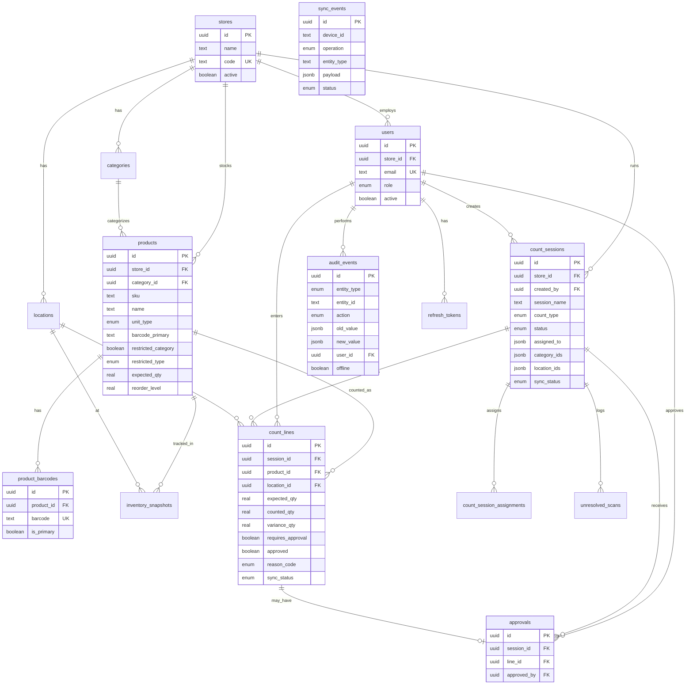

# ShopCount Architecture

## Entity Relationship Diagram



## Folder Structure

```
apps/mobile/
├── app/                    # Expo Router screens
│   ├── (tabs)/            # Bottom tab navigation
│   ├── count/             # Count workflow screens
│   └── product/           # Product detail
├── src/
│   ├── api/               # HTTP client
│   ├── components/        # Reusable UI
│   ├── db/                # SQLite + Drizzle schema
│   ├── lib/               # Auth, sync, utils
│   └── stores/            # Zustand stores

apps/api/
├── src/
│   ├── db/                # PostgreSQL schema, seed, migrate
│   ├── lib/               # JWT, password, variance
│   ├── middleware/        # Auth middleware
│   ├── repositories/      # Data access layer
│   ├── routes/            # Express routes
│   └── services/          # Business logic
└── drizzle/               # SQL migrations

packages/types/
└── src/
    ├── enums.ts           # Shared enums
    ├── schemas.ts         # Zod validation schemas
    └── api.ts             # API response types
```

## Mobile Navigation Plan

```
Root Stack
├── index (splash → redirect)
├── login
├── (tabs)
│   ├── dashboard
│   ├── products
│   ├── counts
│   └── settings
├── product/[id]
├── count/create
├── count/[id]
├── count/scan
├── count/manual
├── count/review
├── count/restricted
└── audit
```

## Offline-First Sync Strategy

1. All count operations write to local SQLite first
2. Each mutation enqueues a sync item with client timestamp
3. Background sync processes queue when online (FIFO)
4. Server applies last-write-wins with full audit trail
5. Conflicts logged in `sync_events` with status `failed`
6. UI shows per-session sync status chips

## Restricted Item Business Rules

- Alcohol/tobacco flagged with purple badge in UI
- Variance ≥ 2 units OR ≥ 5% requires manager approval
- Any negative variance on restricted items requires approval
- Manual edits after initial count always logged in audit trail
- Reason codes required for restricted discrepancies

## Role Permissions

| Action | Staff | Manager | Owner |
|--------|-------|---------|-------|
| Create/edit count lines | ✅ | ✅ | ✅ |
| Submit session for review | ✅ | ✅ | ✅ |
| Review variances | ❌ | ✅ | ✅ |
| Approve lines/sessions | ❌ | ✅ | ✅ |
| View audit history | ❌ | ✅ | ✅ |
| Manage products/users | ❌ | ❌ | ✅ |
| View reports | ❌ | ✅ | ✅ |
